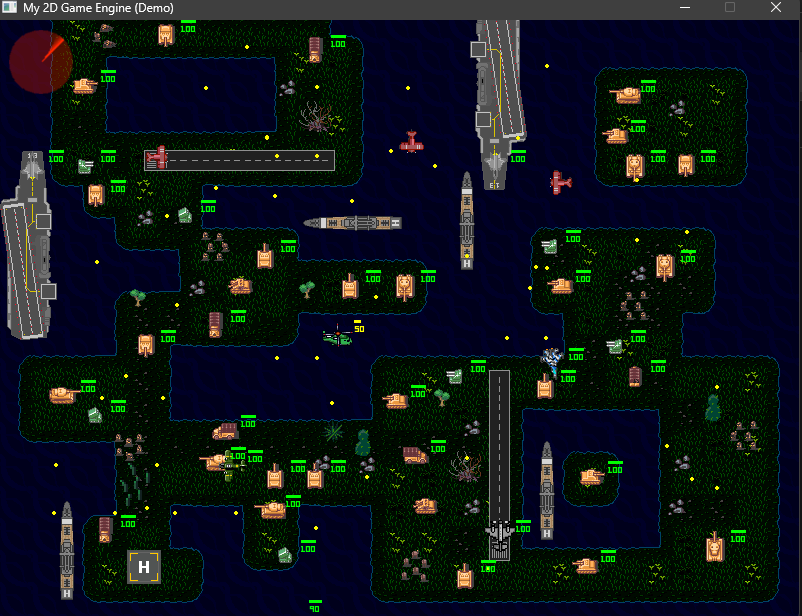
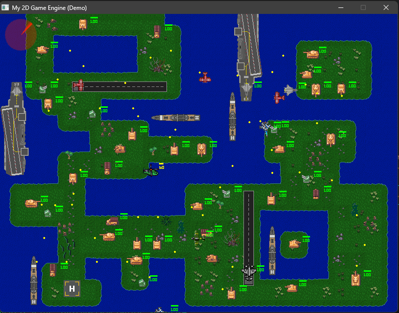
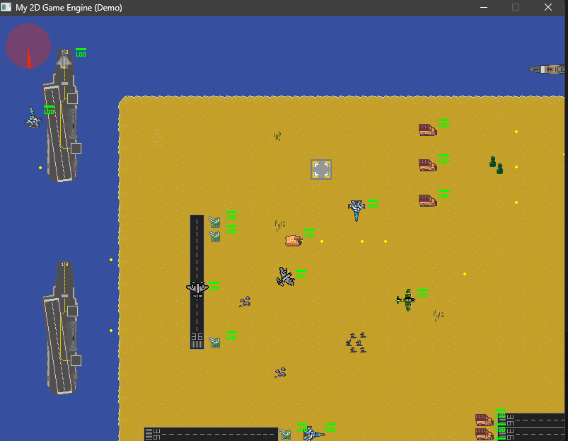

# 2D Game Engine

A high-performance, data-oriented 2D game engine built with **C++23**, **SDL2**, and a custom **Entity Component System (ECS)** architecture.


## Table of Contents

- [Features](#features)
- [Screenshots](#screenshots)
- [Requirements](#requirements)
- [Project Structure](#project-structure)
- [Building](#building)
  - [Windows (MinGW)](#windows-mingw)
  - [Windows (CMake)](#windows-cmake)
  - [Linux / macOS](#linux--macos)
- [Running](#running)
- [Controls](#controls)
- [Architecture](#architecture)
- [Dependencies](#dependencies)
- [Adding Content](#adding-content)
- [Assumptions & Notes](#assumptions--notes)
- [License](#license)

---

## Features

- **Custom ECS Framework**: High-performance Entity Component System with contiguous memory pools
- **SDL2 Rendering**: Hardware-accelerated 2D rendering with sprite batching and z-index sorting
- **Animation System**: Sprite sheet animations with configurable frame rates
- **Collision Detection**: Axis-aligned bounding box (AABB) collision with event-based response
- **Keyboard Input**: Event-driven input handling with key press/release events
- **Camera System**: Smooth camera following with entity tracking
- **Projectile System**: Configurable projectile emitters with velocity and lifecycle management
- **Health & Damage System**: Entity health tracking with damage events and visual feedback
- **Lua Scripting**: Runtime scripting with Sol2 bindings for entity behavior
- **ImGui Integration**: Debug GUI overlay for runtime inspection
- **Tilemap Support**: CSV and TMX tilemap loading with pugixml
- **Text Rendering**: SDL_ttf-based text with custom fonts
- **Asset Management**: Centralized texture, font, and sound asset loading
- **Type-Safe Event Bus**: Decoupled system communication via events

---

## Screenshots







---

## Requirements

### Compiler
- **C++23 compatible compiler**
  - GCC 13+ (MinGW-w64 on Windows)
  - Clang 16+
  - MSVC 2022+ (v143 toolset)

### Build Tools
- **Make** (GNU Make 4.0+) for Makefile builds
- **CMake** (3.20+) for CMake builds

### Platform
- Windows 10/11 (primary development platform)
- Linux (tested on Ubuntu 22.04+)
- macOS (requires Homebrew for dependencies)

---

## Project Structure

```
2DGameEngine/
├── assets/                  # Game assets
│   ├── fonts/               # TTF font files
│   ├── images/              # Sprite sheets and textures
│   ├── scripts/             # Lua level scripts
│   ├── sounds/              # Audio files (SDL_mixer format)
│   └── tilemaps/            # Map files (.map, .tmx, .tsx)
├── bin/                     # Build output directory
│   ├── game.exe             # Compiled executable
│   ├── *.dll                # Runtime DLLs (Windows)
│   └── obj/                 # Object files
├── include/                 # Header files
│   ├── AssetStore/          # Asset management
│   ├── Components/          # ECS component definitions
│   ├── ECS/                 # Core ECS framework
│   ├── EventBus/            # Event system
│   ├── Events/              # Event type definitions
│   ├── SDL2Ext/             # SDL2 extension headers
│   ├── Systems/             # ECS system implementations
│   ├── Game.h               # Main game class
│   ├── LevelLoader.h        # Level loading interface
│   └── Logger.h             # Logging utilities
├── lib/                     # Static libraries (Windows)
│   ├── libSDL2*.a           # SDL2 import libraries
│   └── liblua53.a           # Lua static library
├── src/                     # Source files
│   ├── AssetStore/          # Asset store implementation
│   ├── ECS/                 # ECS implementation
│   ├── SDL2Ext/             # SDL2_gfx primitives (C)
│   ├── Game.cpp             # Main game loop
│   ├── LevelLoader.cpp      # Level loading from Lua
│   ├── Logger.cpp           # Console logging
│   └── Main.cpp             # Entry point
├── vendor/                  # Third-party libraries
│   ├── glm/                 # OpenGL Mathematics
│   ├── imgui/               # Dear ImGui + backends
│   ├── lua/                 # Lua 5.3 headers
│   ├── pugixml/             # XML parser
│   ├── SDL2/                # SDL2 headers
│   └── sol2/                # Lua C++ bindings
├── .github/
│   └── copilot-instructions.md  # AI coding guidelines
├── .vscode/
│   └── tasks.json           # VS Code build tasks
├── CMakeLists.txt           # CMake build configuration
├── Makefile                 # GNU Make build configuration
└── README.md                # This file
```

---

## Building

### Windows (MinGW)

**Prerequisites:**
- MinGW-w64 with GCC 13+ installed (e.g., via MSYS2 or standalone)
- GNU Make

**Build Commands:**

```powershell
# Debug build (default)
make debug

# Release build (optimized)
make release

# Clean build artifacts
make clean

# Build and run
make run
```

### Windows (CMake)

**Prerequisites:**
- CMake 3.20+
- MinGW-w64 with GCC 13+ OR Visual Studio 2022

**Using MinGW Makefiles:**

```powershell
mkdir build
cd build
cmake .. -G "MinGW Makefiles" -DCMAKE_BUILD_TYPE=Debug
cmake --build .
```

**Using Visual Studio:**

```powershell
mkdir build
cd build
cmake .. -G "Visual Studio 17 2022"
cmake --build . --config Debug
```

### Linux / macOS

**Prerequisites:**
- GCC 13+ or Clang 16+
- SDL2 development libraries installed via package manager

**Install Dependencies (Ubuntu/Debian):**

```bash
sudo apt update
sudo apt install libsdl2-dev libsdl2-image-dev libsdl2-mixer-dev libsdl2-ttf-dev liblua5.3-dev
```

**Install Dependencies (macOS):**

```bash
brew install sdl2 sdl2_image sdl2_mixer sdl2_ttf lua@5.3
```

**Build:**

```bash
make debug   # or make release
make run
```

---

## Running

The executable expects to run from the `bin/` directory to locate assets correctly.

**From project root:**

```powershell
# Windows
cd bin
.\game.exe

# Linux/macOS
cd bin
./game
```

**Using Make:**

```powershell
make run
```

**Note:** On Windows, all required DLLs must be present in the `bin/` directory. These are included in the repository.

---

## Controls

| Key | Action |
|-----|--------|
| **W / ↑** | Move up |
| **A / ←** | Move left |
| **S / ↓** | Move down |
| **D / →** | Move right |
| **Space** | Fire projectile |
| **P** | Toggle debug mode (show colliders + ImGui) |
| **Escape** | Exit game |

---

## Architecture

### Entity Component System (ECS)

The engine uses a custom ECS implementation optimized for cache efficiency:

- **Entities**: Lightweight IDs that aggregate components
- **Components**: Plain data structs with no logic
- **Systems**: Process entities with specific component signatures
- **Registry**: Manages entity lifecycle and component pools

### Core Systems

| System | Purpose |
|--------|---------|
| `MovementSystem` | Updates entity positions based on velocity |
| `RenderSystem` | Draws sprites sorted by z-index |
| `AnimationSystem` | Advances sprite sheet animations |
| `CollisionSystem` | Detects AABB collisions, emits events |
| `DamageSystem` | Handles collision damage events |
| `KeyBoardControlSystem` | Translates input to entity movement |
| `CameraMovementSystem` | Follows entities with CameraFollowComponent |
| `ProjectileEmitSystem` | Spawns projectiles from emitters |
| `ProjectileLifecycleSystem` | Destroys expired projectiles |
| `RenderTextSystem` | Renders text labels |
| `RenderHealthBarSystem` | Draws health bars above entities |
| `GUIRenderSystem` | Renders ImGui debug interface |
| `ScriptSystem` | Executes Lua scripts per entity |

### Event System

Type-safe event dispatching for decoupled system communication:

- `CollisionEvent`: Emitted when two entities collide
- `KeyPressedEvent`: Emitted on key down
- `KeyReleasedEvent`: Emitted on key up

---

## Dependencies

All dependencies are vendored in the `vendor/` directory for reproducible builds.

| Library | Version | Purpose |
|---------|---------|---------|
| **SDL2** | 2.x | Window, rendering, input, audio |
| **SDL2_image** | 2.x | Image loading (PNG, JPG) |
| **SDL2_mixer** | 2.x | Audio playback |
| **SDL2_ttf** | 2.x | TrueType font rendering |
| **GLM** | 0.9.9+ | Mathematics (vectors, matrices) |
| **Dear ImGui** | 1.89+ | Debug GUI overlay |
| **Lua** | 5.3 | Scripting runtime |
| **Sol2** | 3.x | C++/Lua bindings (header-only) |
| **pugixml** | 1.13+ | XML parsing for TMX tilemaps |
| **SDL2_gfx** | - | Primitives rendering (vendored source) |

---

## Adding Content

### Adding a New Level

1. Create `assets/scripts/LevelX.lua` following existing level format
2. Define assets, tilemap, and entities tables
3. Change level number in `Game.cpp` → `loader.LoadLevel(..., X)`

### Adding New Sprites

1. Place PNG/JPG in `assets/images/`
2. Add texture in Lua level script or via `assetStore->AddTexture()`
3. Reference by asset ID in `SpriteComponent`

### Adding New Fonts

1. Place TTF in `assets/fonts/`
2. Load via `assetStore->AddFont("id", "path", size)`
3. Use in `TextLabelComponent`

---

## Assumptions & Notes

The following assumptions were made during engine development:

1. **Asset Paths**: All asset paths are relative to the executable location (`bin/`). Use `../assets/` prefix when loading assets.

2. **Window Size**: The game window is created at 800×600 pixels. Full display dimensions are queried but used only for reference.

3. **Frame Rate**: The game targets 60 FPS with vsync enabled. Delta time is used for frame-rate independent movement.

4. **Tilemap Format**: The engine supports simple CSV `.map` files. Full TMX support via pugixml is available but uses a custom parser.

5. **Lua Scripts**: Level scripts must define `Level.assets`, `Level.tilemap`, and `Level.entities` tables.

6. **Z-Index Rendering**: Lower z-index values render first (background). Higher values render on top (foreground).

7. **Collision Groups**: Entities can be tagged and grouped for selective collision handling.

8. **Debug Mode**: Press `P` to toggle debug visualization. This is a runtime toggle, not a compile-time flag.

9. **DLL Dependencies (Windows)**: All SDL2 DLLs and lua53.dll must be in the same directory as the executable.

10. **C++23 Requirement**: The codebase uses C++23 features (ranges, views). Older compilers will fail to build.

---

## License

This project is provided for educational purposes. See individual vendor libraries for their respective licenses.

---

## Acknowledgments

- [SDL2](https://www.libsdl.org/) - Simple DirectMedia Layer
- [Dear ImGui](https://github.com/ocornut/imgui) - Immediate Mode GUI
- [GLM](https://github.com/g-truc/glm) - OpenGL Mathematics
- [Sol2](https://github.com/ThePhD/sol2) - C++ Lua Bindings
- [pugixml](https://pugixml.org/) - XML Parser
